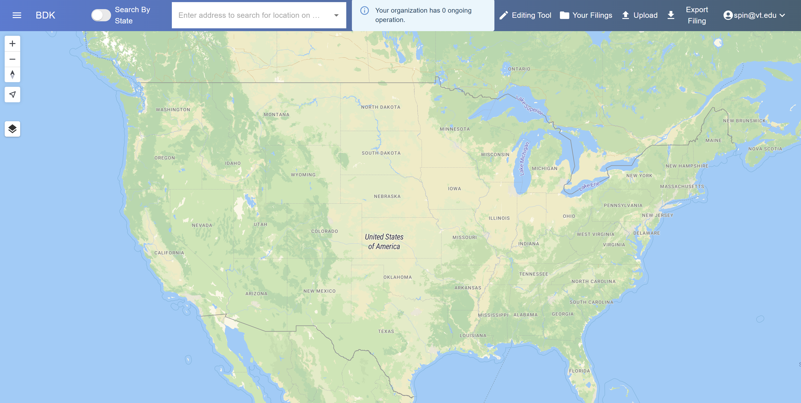

# Broadband Data Kit (BDK)

A tool that helps you complete your biannual FCC-required BDC filing.

## Useful Links
1. [User Guide](./pages/user_guide.html)
2. [Service Documentation](./pages/service_documentation/index.html)
3. [Developer Documentation](./pages/developer_documentation/index.html)
4. [Concepts](./pages/concepts.html)

## What is BDK?

The Broadband Data Kit (BDK) is an intuitive and automated tool developed by the SPIN Lab at Virginia Tech to help you complete your biannual FCC-required BDC filing. Features include:
- **`Visualization`**: Get a clear overview of your network data. See which fabric locations are served by your network, ensuring you have a comprehensive understanding of your coverage.
- **`Dynamic Map Editing`**: We understand that networks are ever-evolving. With our dynamic map editing feature, you can update and document the fabric locations your network serves as they change over time.
- **`Automated Reporting`**: Once you input your data and specify the locations you cover, BDK will generate a customized report, formatted and compliant with FCC guidelines, ready for submission.