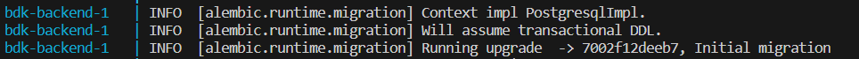
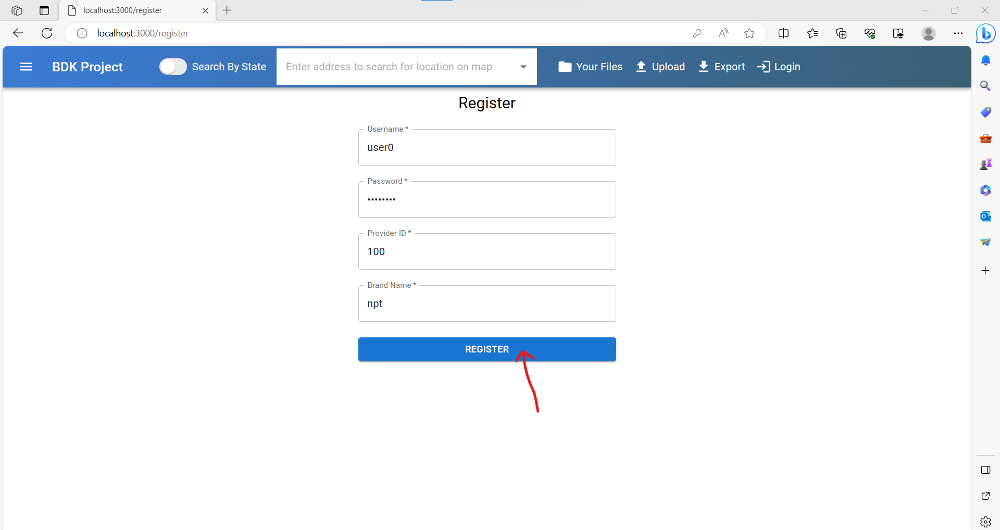

# Local Environment Setup

## Steps to Setup Your Development Environment

1. Clone the repository at <a href="https://github.com/spin-vt/bdk" target="_blank">github.com/spin-vt/bdk</a> with the following command (choose your preferred method):
```
git clone git@github.com:spin-vt/bdk.git #(clone with SSH, recommended)
```
```
git clone <https://github.com/spin-vt/bdk.git> #(clone with HTTPS)
```

2. Move into the cloned directory using the following command:
```
cd bdk
```

3. Create a **.env** file in the **bdk** directory with the following command (or do it in VS code):
```
touch .env
```

4. Paste the following configurations into the .env file (any lines that are commented (#) need to be changed with your information):
```
# POSTGRES_USER=postgres
# POSTGRES_PASSWORD=password
POSTGRES_DB=postgres
POSTGRES_HOST_AUTH_METHOD=trust
DB_HOST=db
DB_PORT=5432
SECRET_KEY=ADFAKJFDLJEOQRIOPQ498689780
JWT_SECRET=ADFAKJFDLJEOQRI
DOCKER_IMAGE_BACKEND=ghcr.io/spin-vt/backend
DOCKER_IMAGE_WORKER=ghcr.io/spin-vt/worker
DOCKER_IMAGE_FRONTEND=ghcr.io/spin-vt/frontend
DOCKER_IMAGE_NGINX=ghcr.io/spin-vt/my-nginx
JWT_TOKEN_LOCATION=cookies
JWT_ACCESS_COOKIE_NAME=token
# POSTGRES_ADMIN_EMAIL=example@examplemail.com
# POSTGRES_ADMIN_PASSWORD=somepassword
NGINX_IMAGE=my-nginx
DEVELOP_BACKEND_PORT=8000
DEVELOP_FRONTEND_PORT=3000
MAIL_SERVER=live.smtp.mailtrap.io
MAIL_PORT=587
MAIL_USE_TLS=true
MAIL_USE_SSL=false
CELERY_BROKER_URL=redis://redis:6379/0
CELERY_RESULT_BACKEND=redis://redis:6379/0
```

5. Login to Github Docker registry with credentials to enable pulling images (substitute **{your_github_personal_access_token}** with your GitHub Personal Access Token and **{your_username}** with your Github username):
```
echo {your_github_personal_access_token} | docker login ghcr.io -u {your_username} --password-stdin
```

6. Pull the prebuilt images:
```
docker-compose pull
```

7. Move into the **front-end** directory with the command:
```
cd front-end
```

8. Run the following commands to go into the frontend docker container:
```
docker run -it --rm -v $(pwd):/app ghcr.io/spin-vt/frontend /bin/sh
```

9. In the docker container, run the following command to install npm packages:
```
npm install
```

10. Create a **.env.local** file in the front-end directory with the following command (or in VS code):
```
touch .env.local
```

11. Paste the following configurations into the **.env.local** file, and make sure the port number at **NEXT_PUBLIC_DEVELOP_BACKEND_URL** matches the **DEVELOP_BACKEND_PORT** in **.env** (substitute **{maptiler_api_key}** with your MapTiler API key):
```
NEXT_PUBLIC_DEVELOP_BACKEND_URL=http://localhost:8000
NEXT_PUBLIC_DEVELOP_MAPTILE_STREET=https://api.maptiler.com/maps/streets/style.json?key={maptiler_api_key}
NEXT_PUBLIC_DEVELOP_MAPTILE_SATELITE=https://api.maptiler.com/maps/satellite/style.json?key={maptiler_api_key}
NEXT_PUBLIC_DEVELOP_MAPTILE_DARK=https://api.maptiler.com/maps/backdrop-darck/style.json?key={maptiler_api_key}
```

12. Return to the **bdk** directory with the following command:
```
cd ..
```

13. Run the BDK application (you might need to stop the container with ^C and rerun this command because on the first run, Postgres (the database), might not be ready when the migration script is run, causing a no-op and resulting in the database not being correctly setup):
```
docker-compose up
```

14. To verify that the database is setup, you can either:
- Verify if the below message exists in your terminal after running docker-compose up

- Go to the register page and register an account. Check if you get redirected to the profile page
