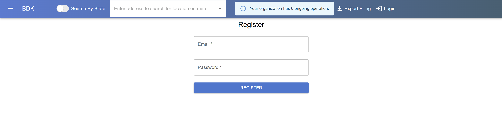
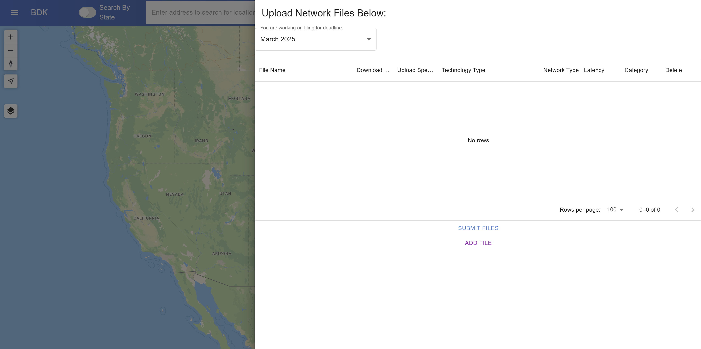
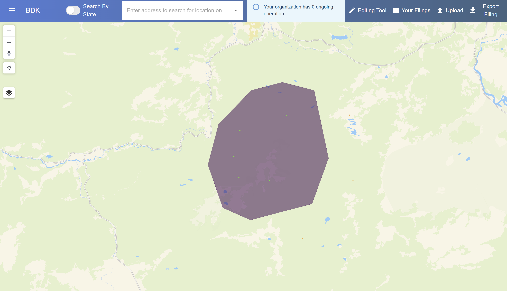
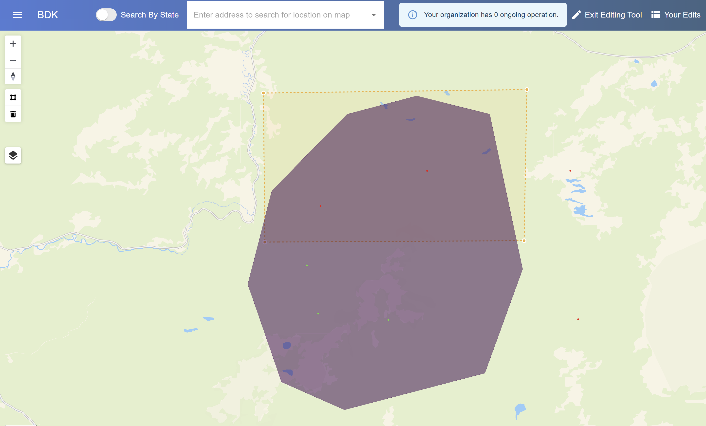
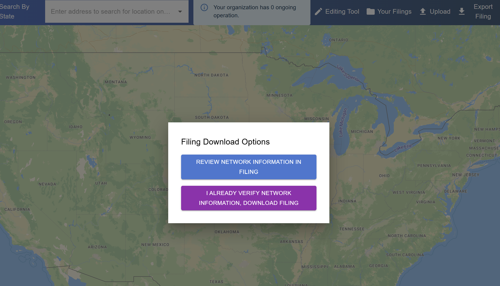
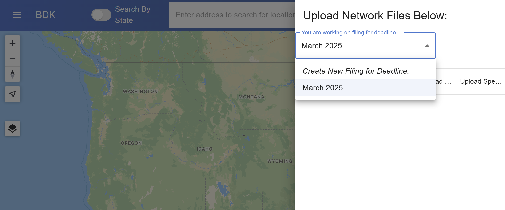

# User Guide

You can visit the BDK Web Portal at <a href="https://bdk.cs.vt.edu" target="_blank">bdk.cs.vt.edu</a>.

If you ever need help understanding a specific feature, visit the [Service Documentation](./service_documentation/index.html) page.

1. **`Account Registration`**: Register by entering your email and password. After your account is created, make sure to verify your email. Additionally, create or join an organization. If you already have an account, you can login.
  - 

2. **`Upload Network Data`**: Provide your network data in KML format. Use line-strings for wired connections and polygons for wireless coverage. Additionally, upload your FCC BSL Fabric dataset. Make sure you select the correct filing deadline.
  - BDK supports the latest Fabric version.
  - 

3. **`Visualization`**: After processing, your data is displayed on a map. This interactive feature lets you zoom in to specific locations, enabling you to validate the tool's accuracy.
  - Clicking on a map marker will give you network information related to that location.
  - The map is color-coded in the following manner:
  - | Color (Hex)                                        | Meaning                          |
    |:---------------------------------------------------|:----------------------------------------|
    | <mark style="background-color: #800080; color: white;">Purple (#800080)</mark> | Your Network Coverage                   |
    | <mark style="background-color: #008000; color: white;">Green (#008000)</mark> | Served Fabric Locations (BSL)           |
    | <mark style="background-color: #FF0000; color: white;">Red (#FF0000)</mark> | Unserved Fabric Locations (BSL)         |
    | <mark style="background-color: #FFA500; color: white;">Orange (#FFA500)</mark> | Non-BSL Locations                       |
  - 

4. **`Editing`**: If discrepancies arise or adjustments are required, use the integrated *Editing Tool* to make necessary changes.
  - 

5. **`Report Generation`**: Once you're satisfied with the accuracy and coverage details, simply click the *Export* button on the navbar to download your comprehensive report.
  - 

6. **`Create a New Report`**: Reupload any updated Fabric or Network files. Additionally, select the new filing deadline.
  - 